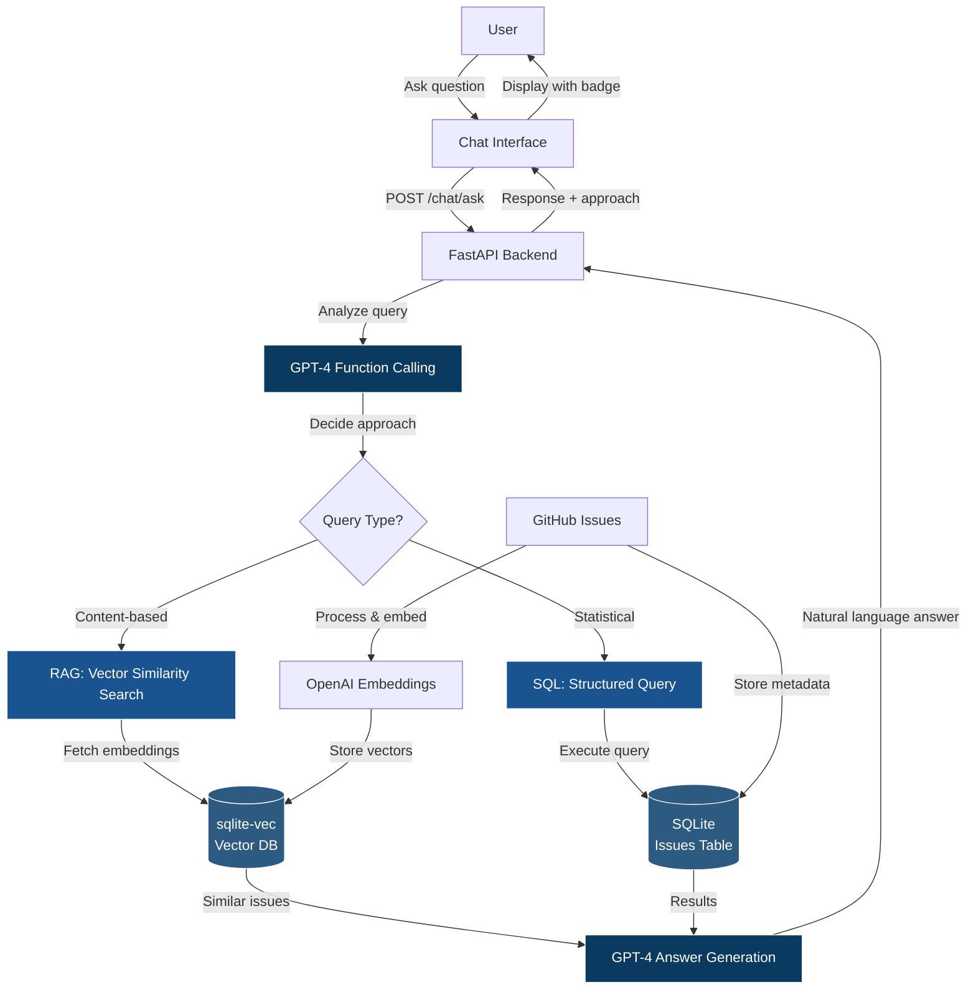

# GitHub Repository Analyzer — System Overview and Design

This application analyzes GitHub repositories and visualizes insights from their issues and metadata. It consists of:
- A FastAPI backend that fetches and caches GitHub data, computes analytics, and serves visualization data.
- A React + Vite TypeScript frontend that lets users enter a repository, then browse metrics, trends, text analysis, and experimental topic modeling.

## System Diagram

```mermaid
graph TD
  U[User Browser] -->|Enter repo, navigate| FE[React + Vite Frontend]
  FE -->|POST /analyze/repo| BE[FastAPI Backend]
  FE -->|POST /visualize/insights| BE
  FE -->|POST /analyze/issues| BE
  FE -->|POST /visualize/wordcloud, /visualize/topics| BE
  FE -->|GET /visualize/topics-from-ldavis, /visualize/ldavis (HTML)| BE
  FE -->|POST/GET /visualize/nomic-atlas-topics| BE
  BE -->|GitHub requests| GH[GitHub REST API]
  BE -->|Cache read/write| DB[(SQLite on Modal Volume /cache-vol)]
  BE -->|Compute| VIS[Visualization Pipeline: wordcloud, basic topics, pyLDAVis, insights, Nomic]
  GH --> BE
  VIS --> BE
```

The app supports multiple topic modeling/visualization strategies:
- Word frequency and treemap visualizations
- Basic topic clustering (placeholder)
- Advanced LDA topic modeling with pyLDAVis
- Optional large-scale topic analysis via Nomic Atlas (requires API key)

### Conversational Bot Architecture



The conversational bot enables users to ask natural language questions about repository issues. It uses:
- **GPT-4 function calling** to intelligently route queries between RAG (semantic search) and SQL (structured queries)
- **Vector embeddings** (OpenAI text-embedding-ada-002) stored in sqlite-vec for similarity search
- **Dual-mode responses**: 
  - RAG for content questions ("What are users complaining about?")
  - SQL for statistics ("How many open bugs?")
- Real-time chat interface with approach badges showing which method was used

Note on architecture.md: `app/architecture.md` describes a broader Option-B architecture (DuckDB, ML, workers). The current implementation is a lean split-tier web app using SQLite caching, FastAPI, and a React UI. It can be evolved toward the fuller architecture over time.

## High-level Features

- Enter a GitHub repo (owner/name or URL) and analyze:
  - Repository metadata (stars, subscribers, open issue count proxy)
  - Issues table with search + filters
  - Trends over time (issue creation rates, cumulative counts, activity heatmaps)
  - Text analysis: word cloud + frequencies, topic summaries
  - Advanced interactive LDA topic viz (pyLDAVis)
  - Experimental Nomic Atlas topic analysis (with async processing and weekly cache)
  - **AI-powered conversational bot** for natural language querying of issues (RAG + SQL)
- Caching layer for API responses and computed visualizations
- Force-refresh option to bypass caches when needed

## Repository Layout

- Backend (FastAPI + Modal + SQLite cache)
  - `app/backend_service/src/agileai/`
    - `common.py` — FastAPI app instance, Modal app/volume/image config, CORS, env loading, AI tools definition
    - `main.py` — API routes, JSON encoding, Modal ASGI entrypoint, caching orchestration, chat endpoint
    - `database.py` — SQLite schema + CRUD for repo info, issues, visualizations, vector storage (sqlite-vec)
    - `github_api.py` — GitHub REST requests + pagination, minimal data shaping
    - `visualization.py` — Word cloud, basic topics, insights metrics, Nomic Atlas integration
  - `app/backend_service/pyproject.toml` — Python pkg + deps (FastAPI, pandas, gensim, pyLDAVis, nomic, openai, sqlite-vec, etc.)
- Frontend (React + Vite + Tailwind-based UI)
  - `app/frontend_service/src/`
    - `pages/LandingPage.tsx` — repo input, routes to `/analyze/:repo`
    - `pages/AnalysisPage.tsx` — orchestrates API calls, tabbed UI, charts, LDA viewer, chat interface
    - `lib/api.ts` — typed API client; uses `VITE_API_URL` for backend base URL
    - `components/Chat/ChatInterface.tsx` — conversational bot UI with message history, typing indicators
    - `components/...` — charts, data table, layout, UI primitives
- Legacy/other
  - `app/streamlit_app.py` — older Streamlit UI (kept around but not primary)
  - `app/architecture.md` — aspirational architecture with ML pipeline

## System Design

### Data Flow (happy path)

1. User enters `owner/repo` or a full GitHub URL on the frontend Landing page.
2. The frontend navigates to `/analyze/:repo`, then concurrently requests:
   - `POST /analyze/repo` → repository info
   - `POST /visualize/insights` → computed analytics from issues
   - `POST /analyze/issues` → raw issue list for the data table
3. Backend checks SQLite cache:
   - If fresh (< 24h), returns cached data with `source: "cache"`
   - Else fetches GitHub, computes analytics, saves, returns `source: "api"`
4. When the user opens Text Analysis:
   - Word cloud → `POST /visualize/wordcloud?field=title|body` (+ cache)
   - Topics (basic) → `POST /visualize/topics?field=...` (+ cache)
   - Advanced LDA topics:
     - JSON for charts → `GET /visualize/topics-from-ldavis?repo=...&field=...` 
       - Triggers `GET /visualize/ldavis` on cache miss to generate + extract topic JSON
     - Interactive HTML → `GET /visualize/ldavis?repo=...&field=...` (embeds pyLDAVis HTML)
   - Nomic Atlas (optional, requires `NOMIC_API_KEY`):
     - `POST /visualize/nomic-atlas-topics` (weekly cache; may return status=processing/timeout)
5. When the user opens Experimental tab:
   - Conversational bot → `POST /chat/ask` with user question
     - Backend uses GPT-4 to analyze query intent
     - Routes to RAG (vector search) or SQL (structured query)
     - Returns natural language answer with approach indicator
   - Issues are automatically processed and embedded on first load
   - Chat history maintained for context-aware conversations

### Backend Architecture

- Frameworks: FastAPI, Modal (for deployment/runtime & persistent Volume), SQLite
- CORS: configured in `common.py` for `http://localhost:5173` and extended to `*` in `main.py`
- JSON encoding: custom encoder handles numpy types, pandas timestamps
- Caching strategy:
  - SQLite DB stored on a Modal Volume (path `/cache-vol/template.db`)
  - TTL defaults:
    - Repo info/issues/visualizations: 24 hours
    - Nomic Atlas visualizations: 168 hours (7 days), with special handling for “processing” state
- Tables (see `database.py`):
  - `repository_data(repo_name UNIQUE, repo_info JSON, last_updated TIMESTAMP)`
  - `repository_issues(repo_name UNIQUE, issues_data JSON, last_updated TIMESTAMP)`
  - `visualization_cache(repo_name, visualization_type, data JSON, last_updated TIMESTAMP, UNIQUE(repo_name, visualization_type))`
  - `issues(repo_name, issue_number, title, body, state, created_at, UNIQUE(repo_name, issue_number))` — for SQL queries
  - `vec_issues(rowid, issue_embedding BLOB)` — virtual table for vector similarity search using sqlite-vec
- GitHub client:
  - Uses REST endpoints (`/repos/{repo}`, `/repos/{repo}/issues` with pagination)
  - Optional auth via `GITHUB_TOKEN` to increase rate limits
  - Shapes issues into a consistent structure with derived `time_to_close` in hours
- Visualizations (`visualization.py`):
  - Word cloud and frequency treemap via `wordcloud` lib
  - Basic topic modeling placeholder (word-frequency chunking)
  - Insights metrics (state distribution, time-to-close stats in days, top contributors, comments stats, issues over time, activity heatmaps)
  - Advanced LDA (gensim + pyLDAVis) producing:
    - Full HTML page (via CDN assets) cached under `ldavis_{field}`
    - Extracted topic JSON (terms, frequencies, topic-term distributions) cached under `topics_from_ldavis_{field}`
  - Nomic Atlas integration:
    - Creates a project/map, polls for topics, returns status+data, caches weekly
    - Requires `NOMIC_API_KEY`
    - Topic modeling approach:
      - Embeds text using Nomic's embedding model
      - Clusters embeddings using statistical clustering algorithms
      - Generates human-readable topic labels via computational linguistics + LLM
      - Produces hierarchical topic organization for multi-level analysis
      - Advantages over LDA: semantic understanding vs keyword co-occurrence, automatic labeling, visual exploration
  - Conversational bot (chat with issues):
    - Uses OpenAI GPT-4 function calling to route queries
    - RAG mode: similarity_search_issues() via sqlite-vec for semantic search
    - SQL mode: execute_sql_query_on_issues() for structured queries
    - Automatic embedding generation with text-embedding-ada-002
    - Requires `OPENAI_API_KEY`

### Frontend Architecture

- React + Vite + TypeScript
- Pages:
  - Landing: input repo URL or `owner/repo`; navigates to Analysis
  - Analysis: tabs for Overview, Trends, Details, Experimental
- API client (`src/lib/api.ts`):
  - Base URL from `VITE_API_URL` (default `http://localhost:8000`)
  - Typed responses for repository info, insights, issues, word cloud, topics, Nomic data
  - Uses both POST endpoints and a direct fetch to `/visualize/topics-from-ldavis` for advanced topics
- Visuals:
  - Recharts/ApexCharts for pie, bar, line, scatter, treemap
  - Table with search + filters
  - PyLDAVis viewer component for interactive LDA HTML
  - ChatInterface component with message bubbles, typing indicators, approach badges (RAG/SQL)

## API Surface (selected)

- Health
  - `GET /` → `{ message: "GitHub Repository Analyzer API" }`
- Repository & issues
  - `GET /api/repository/{repo}?force_refresh=&github_token=`
  - `GET /api/issues/{repo}?force_refresh=&github_token=`
  - Backward-compatible POSTs:
    - `POST /analyze/repo` → `{ repo, github_token?, force_refresh? }`
    - `POST /analyze/issues` → same shape
- Insights
  - `GET /api/insights/{repo}` (or `POST /visualize/insights`)
- Text analysis
  - `POST /visualize/wordcloud?field=title|body`
  - `POST /visualize/topics?field=title|body` (basic placeholder)
  - `GET /visualize/ldavis?repo=...&field=title|body` → HTML
  - `GET /visualize/topics-from-ldavis?repo=...&field=...` → JSON extracted from pyLDAVis
- Cache utilities
  - `GET /cache/status/{repo}`
  - `POST /cache/status` → body `{ repo }`
  - `DELETE /api/cache/{repo}` and `POST /cache/clear` → body `{ repo }`
- Nomic Atlas (optional)
  - `POST /visualize/nomic-atlas-topics` → `{ repo, field, nomic_api_key?, github_token?, force_refresh? }`
  - `GET /visualize/nomic-atlas-topics?repo=...&field=...&nomic_api_key=...`
- Conversational Bot
  - `POST /chat/ask` → `{ repo, query, github_token? }` → returns `{ answer, approach: "rag"|"sql", chat_history?, results? }`
  - `GET /chat/test/{repo}` → Test endpoint for verifying embeddings and similarity search

All JSON responses use a custom encoder to handle numpy/pandas types. Visualization endpoints generally return a wrapper like `{ status: "success", data, source: "cache"|"api"|"generated" }`. Some may return raw HTML (pyLDAVis).

## Environment Variables

- Backend
  - `GITHUB_TOKEN` (optional but recommended for higher rate limits)
  - `NOMIC_API_KEY` (required for Nomic Atlas endpoints)
  - `OPENAI_API_KEY` (required for conversational bot/chat features)
  - `.env` loading: First from CWD, then from `app/backend_service/src/agileai/.env` if present
- Frontend
  - `VITE_API_URL` (e.g., `http://localhost:8000` or your deployed backend URL)

## Running Locally

There are two common ways to run the backend: locally with Uvicorn, or via Modal (recommended for the Modal Volume configuration).

### 1) Backend: Local (Uvicorn)

Prereqs: Python 3.12

- Create a virtualenv and install:
  ```
  cd app/backend_service
  python -m venv .venv
  source .venv/bin/activate
  pip install -U pip
  pip install -e .
  ```
  Alternatively:
  ```
  pip install -r requirements.txt
  ```

- Prepare a writable cache directory:
  - The code uses a Modal Volume mounted at `/cache-vol` for the SQLite DB. If you run locally without Modal, ensure `/cache-vol` exists and is writable, or run under Modal (see next section).
  - Example (macOS):
    ```
    sudo mkdir -p /cache-vol
    sudo chmod 777 /cache-vol
    ```
    Note: You can change this strategy in code by adapting `VOLUME_DIR` in `common.py` for purely local development.

- Run the FastAPI app:
  ```
  uvicorn agileai.main:fastapi_app --host 0.0.0.0 --port 8000 --reload
  ```

- Optional: Provide tokens via environment `.env`:
  ```
  GITHUB_TOKEN=ghp_xxx
  NOMIC_API_KEY=xxx
  OPENAI_API_KEY=sk-xxx
  ```

### 2) Backend: Modal (recommended)

- Ensure your environment is logged into Modal and the `modal` Python package is installed.
- This project defines:
  - A Modal `App` and an `Image` built from `pyproject.toml`
  - A persistent `Volume` named `sqlite-db-vol` mounted at `/cache-vol`
  - An ASGI entrypoint via `@asgi_app()`
- Typical Modal workflows:
  - Local serve for development:
    ```
    modal serve app/backend_service/src/agileai/main.py
    ```
  - Deploy to Modal:
    ```
    modal deploy app/backend_service/src/agileai/main.py
    ```
  - Then set the frontend `VITE_API_URL` to the URL provided by Modal.

### Frontend (Vite + React)

- Install and run:
  ```
  cd app/frontend_service
  npm install
  echo "VITE_API_URL=http://localhost:8000" > .env.local   # or Modal URL
  npm run dev
  ```
- Open http://localhost:5173 and test with e.g. `facebook/react`.

## Caching & Refresh

- Default TTL: 24h for repo info, issues, and most visualizations. Nomic Atlas data: 7 days, with special “processing” handling and periodic retries.
- To bypass cache:
  - Set `force_refresh=true` on relevant endpoints (`/api/repository`, `/api/issues`, `/api/insights`, etc.)
- To clear cache for a repo:
  - `DELETE /api/cache/{owner/repo}`
  - or `POST /cache/clear` with body `{ "repo": "owner/repo" }`

## Data Contracts (selected)

- RepositoryInfo:
  - `{ num_pull_requests: number, num_contributors: number, num_stargazers: number }`
- Issue:
  - `{ title, body, state, user, comments, labels[], created_at ISO, closed_at ISO|null, time_to_close hours|null }`
- Insights:
  - `{ state_distribution, time_to_close_stats, top_contributors, comments_stats, issues_over_time[], state_over_time[], activity_heatmap[] }`
- WordCloudData:
  - `{ wordcloud: { words: [{ text, value }] }, treemap: { children: [{ name, value }] } }`
- TopicModelingData (basic):
  - `{ topics: [{ id, words: [{ text, value }], label }] }`
- Topics-from-ldavis (advanced):
  - `{ topics[], terms[], term_frequency[], topic_term_dists[][] }`
- NomicAtlasTopicData:
  - May include `{ status: "processing"|"timeout"|"complete"|"error", topics[], topic_counts{}, topic_groups{}, topic_hierarchy{} }`
- ChatResponse:
  - `{ answer: string, approach: "rag"|"sql", results?: any[], chat_history?: any[], sql_query?: string }`

## Error Handling & Limits

- Unauthenticated GitHub requests are subject to strict rate limits; set `GITHUB_TOKEN` to avoid frequent 403s.
- The LDA pipeline requires enough textual data (min ~5 docs). Low-data repos will skip topic outputs.
- Nomic Atlas calls can return “Dataset is locked for state access” during processing; the frontend retries with backoff and surfaces helpful messages.
- pyLDAVis endpoint returns HTML; the app also extracts JSON for charts where helpful.

## Extending Toward Option-B Architecture

- Replace SQLite + Modal Volume with DuckDB/Parquet in `app/storage/` for analytics at scale.
- Move ingestion to background workers (`app/workers`), with incremental fetch and feature engineering.
- Add ML training/prediction services in `app/core`, surface prediction endpoints, and integrate into UI.
- Introduce proper auth/rate limiting, and production-grade infra (Docker/K8s, observability).

## Legacy Streamlit

An earlier Streamlit UI remains at:
```
streamlit run streamlit_app.py --server.enableCORS false --server.enableXsrfProtection false
```
The React frontend is the primary UI going forward.

## License

TBD. Add your license here.
